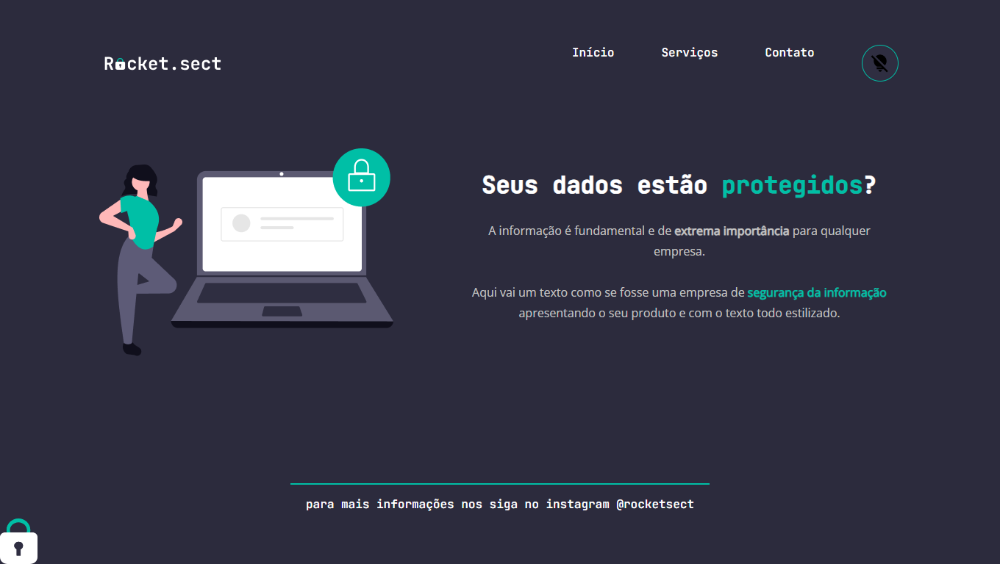

<h1 align="center"> Desafio avançado - Recriando layout</h1>

Resolvendo bug iniciante do modulo explorer 
<a href="https://spgunk.eu.org">Meu portifolio em NextJS</a>

  <a href="#-tecnologias">Tecnologias</a>&nbsp;&nbsp;&nbsp;|&nbsp;&nbsp;&nbsp;
  <a href="#-projeto">Projeto</a>&nbsp;&nbsp;&nbsp;|&nbsp;&nbsp;&nbsp;
  <a href="#-layout">Layout</a>&nbsp;&nbsp;&nbsp;|&nbsp;&nbsp;&nbsp;
  <a href="#memo-licença">Licença</a>

  

 

## 💻  Sobre o desafio

Nesse desafio, você deverá recriar uma aplicação, a partir de um layout, para treinar o que aprendeu até agora no **Stage 02**.

## 🚀 Tecnologias

Esse projeto foi desenvolvido com as seguintes tecnologias:

- Figma
- HTML e CSS
- JavaScript (não tava no desafio)
- SweetAlet2 (Não tava no desafio)
- Git e Github

## 🔖 Layout

Você pode visualizar o layout do projeto através [DESSE LINK](https://www.figma.com/file/EdKjPWjC8ZlbnH4XzTObv2/Explorer/duplicate). É necessário ter conta no [Figma](https://figma.com) para acessá-lo.

## :memo: Licença

Esse projeto está sob a licença MIT.

---

Feito com ♥ by Hex034 :wave: [Veja outros projetos meus](https://github.com/hex034)